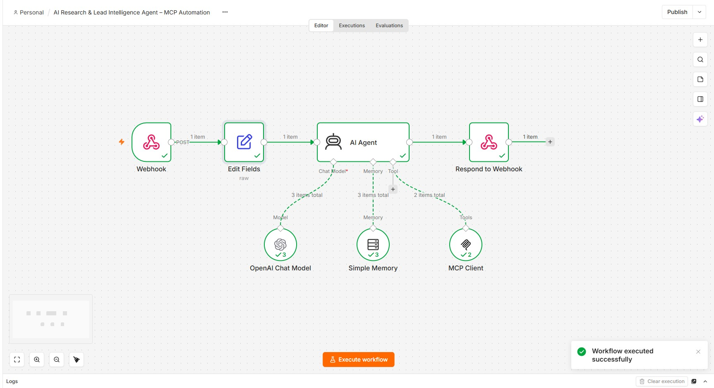
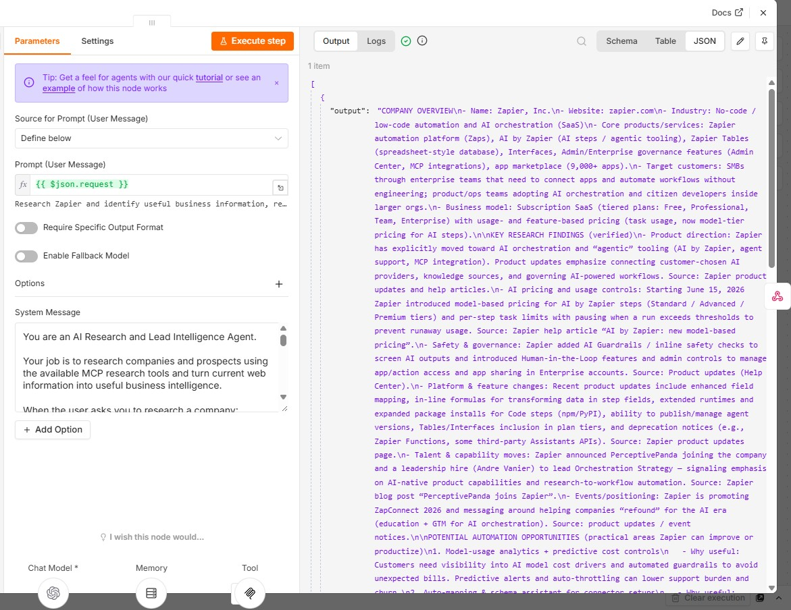
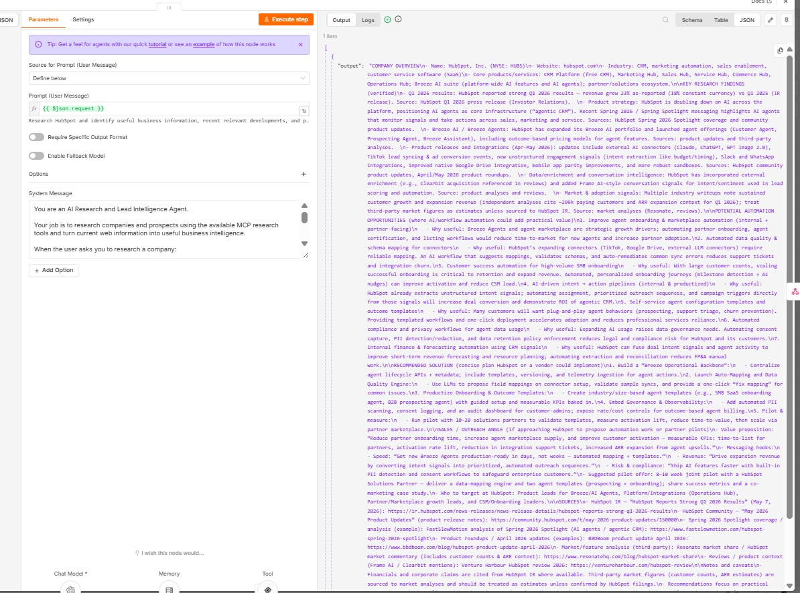

# AI Research & Lead Intelligence Agent – MCP Automation

An AI-powered research and lead intelligence system built with n8n, OpenAI, and MCP (Model Context Protocol).

The agent can research companies using current web information, analyze relevant business developments, identify potential AI automation opportunities, and generate actionable business intelligence.

## 🚀 What This Automation Does

- Accepts company research requests through a webhook
- Uses an AI Agent to understand the research objective
- Connects to external research capabilities through MCP
- Uses current web information for company research
- Identifies relevant business developments
- Finds potential AI automation opportunities
- Generates structured lead intelligence
- Maintains conversational context using memory
- Returns the completed research through the webhook

## 🧠 Example Research Requests

> Research HubSpot and identify useful business information, recent relevant developments, and potential automation opportunities.

> Research Zapier and identify useful business information, recent relevant developments, and potential AI automation opportunities for the company.

## 🛠️ Tech Stack

- n8n
- OpenAI
- AI Agent
- Model Context Protocol (MCP)
- Tavily
- Simple Memory
- Webhooks
- Web Research

## ⚙️ Workflow

1. A research request enters through the webhook.
2. The input is prepared for the AI Agent.
3. The AI Agent analyzes the research objective.
4. MCP provides access to external research tools.
5. The agent researches current company information.
6. Relevant business developments are analyzed.
7. Potential AI automation opportunities are identified.
8. The agent generates structured business intelligence.
9. The final response is returned through the webhook.

## 📸 Project Screenshots

### Successful MCP AI Research Workflow

### Zapier Research & Lead Intelligence Output

### HubSpot Research & Lead Intelligence Output

## 💼 Business Use Cases

- Lead research and qualification
- Company intelligence
- Sales prospect research
- Account research
- AI automation opportunity discovery
- Personalized sales preparation
- Business development research
- Market and competitor research

## 🔒 Security

API credentials, OAuth credentials, authentication tokens, and private configuration data are not included in this repository.

## 👨‍💻 Project

Built as part of my AI automation portfolio using n8n, OpenAI, AI Agents, and Model Context Protocol (MCP).
